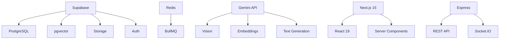
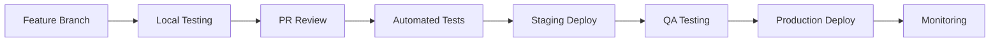

# Cleverly - Product Improvement Roadmap
**Based on Competitive Analysis**
**Date**: January 6, 2026
**Version**: 1.0

---

## Executive Summary

This roadmap outlines strategic improvements to position Cleverly as a market leader in AI-assisted grading. Based on our competitive analysis, we've identified 10 critical features that will differentiate us from Gradescope, Turnitin, GradeLab, and other competitors. The roadmap is organized into 4 sprints (12 weeks) with clear priorities and quick wins.

**Key Metrics to Beat:**
- Grading accuracy: >95% (vs Gradescope's 85-90%)
- Speed: <30 seconds per submission
- Cost: <$5 per student (vs Gradescope's $15-20)
- User satisfaction: NPS >50

---

## Table of Contents

1. [Top 10 Priority Features](#top-10-priority-features)
2. [Feature Details & Implementation](#feature-details--implementation)
3. [Sprint Planning](#sprint-planning-12-weeks)
4. [Quick Wins](#quick-wins-0-2-weeks)
5. [Technical Dependencies](#technical-dependencies)
6. [Success Metrics](#success-metrics)

---

## Top 10 Priority Features

| # | Feature | Priority | Complexity | Sprint | Impact |
|---|---------|----------|------------|--------|--------|
| 1 | **Plagiarism Detection** | P0 | Medium | 1-2 | High - Table stakes feature |
| 2 | **Advanced Analytics Dashboard** | P0 | Medium | 2 | High - Differentiation |
| 3 | **Batch Processing & Bulk Operations** | P0 | Small | 1 | High - Productivity |
| 4 | **LMS Gradebook Export** | P0 | Small | 1 | High - Integration |
| 5 | **Collaborative Grading** | P1 | Large | 3-4 | Medium - Enterprise feature |
| 6 | **Mobile App (PWA)** | P1 | Large | 3-4 | Medium - Accessibility |
| 7 | **Multi-language Support** | P1 | Medium | 2-3 | Medium - Market expansion |
| 8 | **Video Submission Grading** | P1 | Large | 4 | Medium - Innovation |
| 9 | **Enhanced OCR Accuracy** | P0 | Medium | 1-2 | High - Core capability |
| 10 | **Peer Review Workflow** | P2 | Medium | 4 | Low - Nice to have |

**Priority Levels:**
- **P0**: Critical for competitive parity - must have
- **P1**: Important for differentiation - should have
- **P2**: Nice to have - future consideration

---

## Feature Details & Implementation

### 1. Plagiarism Detection
**Priority**: P0 | **Complexity**: Medium | **Sprint**: 1-2

#### Business Justification
- Turnitin's dominance shows this is expected by institutions
- Combining grading + plagiarism = competitive advantage
- Currently a major gap vs competitors

#### Technical Approach
1. **Cosine Similarity Check**: Use existing pgvector infrastructure
   - Compare student answers against each other
   - Flag similarity scores >80%

2. **External API Integration**:
   - Option 1: Copyleaks API (education-focused)
   - Option 2: Integrate with Turnitin API (if available)
   - Option 3: Use GPT-4 for paraphrase detection

3. **Course Material Matching**:
   - Check against uploaded textbooks/study guides
   - Use RAG embeddings for semantic similarity

#### Implementation Details
**Files to Create:**
- `/server/src/services/plagiarismService.ts`
- `/server/src/routes/plagiarism.ts`
- `/client/components/plagiarism/PlagiarismReport.tsx`
- `/client/components/plagiarism/SimilarityChart.tsx`

**Files to Modify:**
- `/server/src/services/gradingService.ts` - Add plagiarism check
- `/server/src/workers/gradingWorker.ts` - Run plagiarism scan
- `/supabase/migrations/008_plagiarism.sql` - New tables

**Database Schema:**
```sql
-- New tables needed
CREATE TABLE plagiarism_checks (
  id UUID PRIMARY KEY DEFAULT uuid_generate_v4(),
  submission_id UUID REFERENCES submissions(id),
  similarity_score FLOAT,
  matched_content TEXT,
  source_type TEXT, -- 'student', 'course_material', 'external'
  source_id UUID,
  flagged_at TIMESTAMP DEFAULT NOW()
);

CREATE INDEX idx_plagiarism_submission ON plagiarism_checks(submission_id);
CREATE INDEX idx_plagiarism_score ON plagiarism_checks(similarity_score DESC);
```

#### Dependencies
- Existing RAG/embedding infrastructure
- Optional: Third-party API (Copyleaks/Turnitin)

#### Estimated Effort
- Backend: 3 days
- Frontend: 2 days
- Testing: 1 day
- **Total: 6 days (1.2 weeks)**

---

### 2. Advanced Analytics Dashboard
**Priority**: P0 | **Complexity**: Medium | **Sprint**: 2

#### Business Justification
- Gradescope has basic analytics; we can differentiate with AI insights
- Helps instructors identify struggling students early
- Provides data-driven teaching improvements

#### Technical Approach
1. **Statistical Analysis**:
   - Question difficulty index
   - Discrimination index (high/low performer comparison)
   - Standard deviation & variance
   - Percentile rankings

2. **AI-Powered Insights**:
   - Use Gemini to analyze patterns in wrong answers
   - Suggest rubric adjustments
   - Identify common misconceptions

3. **Predictive Analytics**:
   - Predict final grade based on current performance
   - Flag at-risk students

#### Implementation Details
**Files to Create:**
- `/server/src/services/analyticsService.ts` (enhance existing)
- `/server/src/services/insightsService.ts`
- `/client/app/analytics/advanced/page.tsx`
- `/client/components/analytics/QuestionDifficultyChart.tsx`
- `/client/components/analytics/StudentCohortAnalysis.tsx`
- `/client/components/analytics/AIInsightsPanel.tsx`
- `/client/components/analytics/PredictiveAnalytics.tsx`

**Files to Modify:**
- `/server/src/routes/analytics.ts` - Add new endpoints
- `/server/src/services/analyticsService.ts` - Enhance calculations
- `/client/app/analytics/page.tsx` - Link to advanced view

**API Endpoints:**
```typescript
GET /api/graders/:id/analytics/advanced
GET /api/graders/:id/analytics/question-difficulty
GET /api/graders/:id/analytics/student-cohorts
POST /api/graders/:id/analytics/ai-insights
GET /api/courses/:id/analytics/trends
```

**New Database Views:**
```sql
-- Create materialized view for performance
CREATE MATERIALIZED VIEW grader_analytics AS
SELECT
  g.id AS grader_id,
  r.id AS rubric_id,
  r.question_number,
  COUNT(sg.id) AS total_attempts,
  AVG(sg.marks_awarded) AS avg_score,
  STDDEV(sg.marks_awarded) AS std_dev,
  COUNT(CASE WHEN sg.marks_awarded = r.max_marks THEN 1 END) AS perfect_scores
FROM graders g
JOIN rubrics r ON r.grader_id = g.id
LEFT JOIN submission_grades sg ON sg.rubric_id = r.id
GROUP BY g.id, r.id, r.question_number;
```

#### Dependencies
- Existing analytics service
- Chart library (recharts - already installed)

#### Estimated Effort
- Backend: 4 days
- Frontend: 4 days
- Testing: 2 days
- **Total: 10 days (2 weeks)**

---

### 3. Batch Processing & Bulk Operations
**Priority**: P0 | **Complexity**: Small | **Sprint**: 1

#### Business Justification
- Critical for productivity with large classes (200+ students)
- Gradescope has this; we need parity
- Quick win with high user satisfaction

#### Technical Approach
1. **Bulk Upload Enhancement**:
   - Drag-and-drop folder support
   - Auto-detect student IDs from filename/barcode
   - Progress bar with pause/resume

2. **Bulk Actions**:
   - Approve all grades
   - Export selected submissions
   - Batch re-grade
   - Bulk feedback comments

3. **Queue Management**:
   - Priority queue for urgent grading
   - Parallel processing optimization

#### Implementation Details
**Files to Create:**
- `/client/components/submissions/BulkUploader.tsx`
- `/client/components/submissions/BulkActionBar.tsx`
- `/server/src/services/batchProcessingService.ts`

**Files to Modify:**
- `/server/src/routes/submissions.ts` - Add bulk endpoints
- `/server/src/workers/gradingWorker.ts` - Optimize parallel processing
- `/client/app/grading/page.tsx` - Add bulk action UI
- `/client/app/grading/upload/page.tsx` - Enhanced uploader

**API Endpoints:**
```typescript
POST /api/graders/:id/submissions/bulk-upload
POST /api/submissions/bulk-approve
POST /api/submissions/bulk-export
POST /api/submissions/bulk-regrade
PATCH /api/submissions/bulk-update
```

#### Dependencies
- Existing BullMQ queue system
- File upload infrastructure

#### Estimated Effort
- Backend: 2 days
- Frontend: 2 days
- Testing: 1 day
- **Total: 5 days (1 week)**

---

### 4. LMS Gradebook Export
**Priority**: P0 | **Complexity**: Small | **Sprint**: 1

#### Business Justification
- Critical integration gap vs Gradescope
- Required for institutional adoption
- Easy win that unblocks sales

#### Technical Approach
1. **LTI 1.3 Grade Passback**:
   - Implement Assignment and Grade Services (AGS)
   - Auto-sync grades to LMS gradebook

2. **CSV Export Templates**:
   - Canvas CSV format
   - Blackboard format
   - Moodle format
   - Generic format

3. **Excel Export Enhancement**:
   - Pre-formatted gradebook template
   - Formulas for grade calculations
   - Student photos (if available)

#### Implementation Details
**Files to Create:**
- `/server/src/services/lmsGradebookService.ts`
- `/server/src/integrations/lms/canvas.ts`
- `/server/src/integrations/lms/blackboard.ts`
- `/server/src/integrations/lms/moodle.ts`
- `/client/components/export/GradebookExporter.tsx`

**Files to Modify:**
- `/server/src/services/ltiService.ts` - Add AGS support
- `/server/src/routes/export.ts` - Add LMS-specific exports
- `/client/app/grading/page.tsx` - Add export dropdown

**API Endpoints:**
```typescript
POST /api/graders/:id/export/lms-gradebook
GET /api/graders/:id/export/canvas-csv
GET /api/graders/:id/export/blackboard-csv
GET /api/graders/:id/export/moodle-csv
POST /api/lti/grade-passback
```

**LTI 1.3 AGS Implementation:**
```typescript
// LTI Grade Passback
interface LTIGradePassback {
  userId: string;
  scoreGiven: number;
  scoreMaximum: number;
  activityProgress: 'Initialized' | 'Started' | 'InProgress' | 'Submitted' | 'Completed';
  gradingProgress: 'FullyGraded' | 'Pending' | 'PendingManual' | 'Failed' | 'NotReady';
}
```

#### Dependencies
- Existing LTI 1.3 infrastructure
- Excel export library (ExcelJS)

#### Estimated Effort
- Backend: 3 days
- Frontend: 1 day
- Testing: 1 day
- **Total: 5 days (1 week)**

---

### 5. Collaborative Grading
**Priority**: P1 | **Complexity**: Large | **Sprint**: 3-4

#### Business Justification
- Enterprise feature for large courses with TAs
- Differentiator vs GradeLab/Eklavvya
- Required for university adoption

#### Technical Approach
1. **Role-Based Access Control**:
   - Instructor (full access)
   - Teaching Assistant (grading only)
   - Grader (limited access)
   - Reviewer (review only)

2. **Assignment Distribution**:
   - Auto-assign submissions to graders
   - Load balancing
   - Blind grading option

3. **Consensus & Moderation**:
   - Multiple graders per submission
   - Automatic flagging for score discrepancies >10%
   - Moderator review queue

4. **Real-time Collaboration**:
   - Live presence indicators
   - Comments/notes on submissions
   - @mentions for questions

#### Implementation Details
**Files to Create:**
- `/supabase/migrations/009_collaborative_grading.sql`
- `/server/src/services/collaborationService.ts`
- `/server/src/middleware/rbac.ts`
- `/client/components/collaboration/GraderAssignment.tsx`
- `/client/components/collaboration/ModerationQueue.tsx`
- `/client/components/collaboration/CommentsPanel.tsx`

**Files to Modify:**
- `/server/src/middleware/auth.ts` - Add role checks
- `/server/src/routes/graders.ts` - Add team management
- `/server/src/services/socketService.ts` - Add presence
- `/client/app/graders/[id]/page.tsx` - Add collaboration UI

**Database Schema:**
```sql
-- New tables
CREATE TABLE grader_team_members (
  id UUID PRIMARY KEY DEFAULT uuid_generate_v4(),
  grader_id UUID REFERENCES graders(id),
  user_id UUID REFERENCES profiles(id),
  role TEXT CHECK (role IN ('instructor', 'ta', 'grader', 'reviewer')),
  permissions JSONB DEFAULT '{}',
  added_at TIMESTAMP DEFAULT NOW()
);

CREATE TABLE submission_assignments (
  id UUID PRIMARY KEY DEFAULT uuid_generate_v4(),
  submission_id UUID REFERENCES submissions(id),
  assigned_to UUID REFERENCES profiles(id),
  assigned_by UUID REFERENCES profiles(id),
  status TEXT DEFAULT 'assigned',
  assigned_at TIMESTAMP DEFAULT NOW()
);

CREATE TABLE submission_comments (
  id UUID PRIMARY KEY DEFAULT uuid_generate_v4(),
  submission_id UUID REFERENCES submissions(id),
  user_id UUID REFERENCES profiles(id),
  comment TEXT NOT NULL,
  mentioned_users UUID[],
  created_at TIMESTAMP DEFAULT NOW()
);

CREATE TABLE moderation_queue (
  id UUID PRIMARY KEY DEFAULT uuid_generate_v4(),
  submission_id UUID REFERENCES submissions(id),
  reason TEXT,
  score_variance FLOAT,
  flagged_at TIMESTAMP DEFAULT NOW(),
  resolved_at TIMESTAMP,
  resolved_by UUID REFERENCES profiles(id)
);
```

#### Dependencies
- Existing auth system
- Socket.IO for real-time features

#### Estimated Effort
- Backend: 8 days
- Frontend: 8 days
- Testing: 4 days
- **Total: 20 days (4 weeks)**

---

### 6. Mobile App (PWA)
**Priority**: P1 | **Complexity**: Large | **Sprint**: 3-4

#### Business Justification
- Competitors lack good mobile experience
- Enable grading on-the-go
- Modern expectation from users

#### Technical Approach
1. **Progressive Web App**:
   - Service worker for offline support
   - App manifest for install prompt
   - Push notifications for grading status

2. **Mobile-First UI**:
   - Touch-optimized components
   - Swipe gestures for navigation
   - Bottom sheet modals

3. **Offline Capabilities**:
   - Cache submissions for offline review
   - Queue grade changes for sync
   - Download PDFs for offline viewing

#### Implementation Details
**Files to Create:**
- `/client/public/sw.js` (Service Worker)
- `/client/public/manifest.json`
- `/client/components/mobile/BottomSheet.tsx`
- `/client/components/mobile/SwipeableCard.tsx`
- `/client/lib/offline-storage.ts`
- `/client/lib/pwa-installer.ts`

**Files to Modify:**
- `/client/app/layout.tsx` - Add PWA meta tags
- `/client/app/page.tsx` - Add install prompt
- All UI components - Make responsive

**Service Worker Setup:**
```typescript
// sw.js - Cache strategy
const CACHE_NAME = 'cleverly-v1';
const urlsToCache = [
  '/',
  '/grading',
  '/courses',
  '/static/css/main.css',
  '/static/js/bundle.js'
];

// Cache-first strategy for static assets
// Network-first for API calls
```

**Manifest:**
```json
{
  "name": "Cleverly AI Grader",
  "short_name": "Cleverly",
  "start_url": "/",
  "display": "standalone",
  "background_color": "#ffffff",
  "theme_color": "#4F46E5",
  "icons": [
    {
      "src": "/icons/icon-192.png",
      "sizes": "192x192",
      "type": "image/png"
    },
    {
      "src": "/icons/icon-512.png",
      "sizes": "512x512",
      "type": "image/png"
    }
  ]
}
```

#### Dependencies
- Next.js PWA plugin
- IndexedDB for offline storage

#### Estimated Effort
- PWA Setup: 3 days
- Mobile UI: 10 days
- Offline Sync: 5 days
- Testing: 4 days
- **Total: 22 days (4.5 weeks)**

---

### 7. Multi-language Support
**Priority**: P1 | **Complexity**: Medium | **Sprint**: 2-3

#### Business Justification
- Enable international expansion (Europe, Asia, Africa)
- Underserved markets = less competition
- Required for government contracts

#### Technical Approach
1. **UI Internationalization**:
   - next-intl for Next.js
   - Language switcher
   - RTL support for Arabic/Hebrew

2. **Content Grading**:
   - Support non-English submissions
   - Multi-language rubrics
   - Gemini supports 100+ languages natively

3. **Priority Languages (Phase 1)**:
   - Spanish (Latin America)
   - French (Africa, Canada)
   - Mandarin (China)
   - Arabic (Middle East)

#### Implementation Details
**Files to Create:**
- `/client/i18n/locales/en.json`
- `/client/i18n/locales/es.json`
- `/client/i18n/locales/fr.json`
- `/client/i18n/locales/zh.json`
- `/client/i18n/locales/ar.json`
- `/client/lib/i18n.ts`
- `/client/components/language/LanguageSwitcher.tsx`

**Files to Modify:**
- All client components - Wrap text in t() function
- `/server/src/prompts/grading.ts` - Language detection
- `/supabase/migrations/010_multi_language.sql` - Add language fields

**Database Schema:**
```sql
-- Add language fields
ALTER TABLE courses ADD COLUMN language TEXT DEFAULT 'en';
ALTER TABLE graders ADD COLUMN language TEXT DEFAULT 'en';
ALTER TABLE rubrics ADD COLUMN language TEXT DEFAULT 'en';

-- Multi-language support for rubrics
CREATE TABLE rubric_translations (
  id UUID PRIMARY KEY DEFAULT uuid_generate_v4(),
  rubric_id UUID REFERENCES rubrics(id),
  language TEXT NOT NULL,
  question_text TEXT,
  expected_answer TEXT,
  keywords TEXT[],
  UNIQUE(rubric_id, language)
);
```

**i18n Configuration:**
```typescript
// client/i18n/config.ts
export const locales = ['en', 'es', 'fr', 'zh', 'ar'] as const;
export type Locale = typeof locales[number];

export const defaultLocale: Locale = 'en';

export const localeNames: Record<Locale, string> = {
  en: 'English',
  es: 'Español',
  fr: 'Français',
  zh: '中文',
  ar: 'العربية'
};
```

#### Dependencies
- next-intl (i18n library)
- Translation services (initial translations)

#### Estimated Effort
- Setup: 2 days
- Translation files: 3 days
- Component updates: 8 days
- Testing: 3 days
- **Total: 16 days (3.2 weeks)**

---

### 8. Video Submission Grading
**Priority**: P1 | **Complexity**: Large | **Sprint**: 4

#### Business Justification
- Innovation beyond competitors
- Required for oral exams, presentations
- Growing demand in hybrid learning

#### Technical Approach
1. **Video Upload & Processing**:
   - Support MP4, WebM, MOV
   - Video compression and thumbnail generation
   - Chapter markers for questions

2. **AI Analysis**:
   - Gemini 1.5 Pro Vision for video analysis
   - Transcription + sentiment analysis
   - Body language assessment (optional)

3. **Rubric Adaptation**:
   - Time-based rubrics (e.g., "At 2:30, student should...")
   - Presentation skills scoring
   - Audio quality checks

#### Implementation Details
**Files to Create:**
- `/server/src/services/videoService.ts`
- `/server/src/workers/videoProcessingWorker.ts`
- `/client/components/video/VideoUploader.tsx`
- `/client/components/video/VideoPlayer.tsx`
- `/client/components/video/VideoRubricEditor.tsx`
- `/client/components/grading/VideoGradingPanel.tsx`

**Files to Modify:**
- `/server/src/routes/submissions.ts` - Accept video uploads
- `/server/src/services/gradingService.ts` - Video grading logic
- `/supabase/migrations/011_video_support.sql`

**Database Schema:**
```sql
-- Add video support
ALTER TABLE submissions ADD COLUMN file_type TEXT DEFAULT 'pdf';
ALTER TABLE submissions ADD COLUMN video_duration INTEGER; -- seconds
ALTER TABLE submissions ADD COLUMN transcript TEXT;

CREATE TABLE video_timestamps (
  id UUID PRIMARY KEY DEFAULT uuid_generate_v4(),
  submission_id UUID REFERENCES submissions(id),
  rubric_id UUID REFERENCES rubrics(id),
  timestamp_seconds INTEGER NOT NULL,
  content TEXT,
  created_at TIMESTAMP DEFAULT NOW()
);
```

**Video Processing:**
```typescript
// Use FFmpeg for video processing
import ffmpeg from 'fluent-ffmpeg';

async function processVideo(filePath: string) {
  // Generate thumbnail
  await ffmpeg(filePath)
    .screenshots({
      timestamps: ['00:00:01'],
      filename: 'thumbnail.png'
    });

  // Get video metadata
  const metadata = await new Promise((resolve, reject) => {
    ffmpeg.ffprobe(filePath, (err, data) => {
      if (err) reject(err);
      else resolve(data);
    });
  });

  return metadata;
}
```

#### Dependencies
- FFmpeg for video processing
- Gemini 1.5 Pro Vision API
- Large storage bucket (Supabase)

#### Estimated Effort
- Backend: 8 days
- Frontend: 6 days
- Testing: 4 days
- **Total: 18 days (3.6 weeks)**

---

### 9. Enhanced OCR Accuracy
**Priority**: P0 | **Complexity**: Medium | **Sprint**: 1-2

#### Business Justification
- Core differentiator vs competitors
- GradeLab claims 99% accuracy - we need to match/exceed
- Poor OCR = poor grades = lost customers

#### Technical Approach
1. **Multi-Model Ensemble**:
   - Gemini Vision (primary)
   - Tesseract OCR (backup)
   - Custom model for math notation

2. **Preprocessing Pipeline**:
   - Image enhancement (contrast, deskew)
   - Handwriting normalization
   - Noise reduction

3. **Math & Diagram Recognition**:
   - LaTeX conversion for equations
   - Graph/diagram extraction
   - Symbol recognition

4. **Confidence Scoring**:
   - Per-character confidence
   - Flag low-confidence regions for review
   - Human-in-the-loop for <80% confidence

#### Implementation Details
**Files to Create:**
- `/server/src/services/imagePreprocessingService.ts`
- `/server/src/services/mathOCRService.ts`
- `/server/src/services/ocrEnsembleService.ts`

**Files to Modify:**
- `/server/src/services/ocrService.ts` - Enhance existing
- `/server/src/workers/gradingWorker.ts` - Use ensemble
- `/client/components/grading/OCRConfidence.tsx`

**Preprocessing Pipeline:**
```typescript
// Image enhancement
import sharp from 'sharp';

async function preprocessImage(buffer: Buffer) {
  return await sharp(buffer)
    .normalize() // Auto-contrast
    .rotate() // Auto-deskew
    .sharpen()
    .greyscale()
    .toBuffer();
}

// Multi-model OCR
async function ensembleOCR(imagePath: string) {
  const [geminiResult, tesseractResult] = await Promise.all([
    geminiOCR(imagePath),
    tesseractOCR(imagePath)
  ]);

  // Compare results, take highest confidence
  return compareAndMerge(geminiResult, tesseractResult);
}
```

**Math Recognition:**
```typescript
// Use Gemini for equation extraction
const MATH_EXTRACTION_PROMPT = `
Extract all mathematical equations from this image.
Output in LaTeX format.
Identify:
- Inline equations
- Display equations
- Diagrams/graphs
`;
```

#### Dependencies
- Sharp (image processing)
- Tesseract.js (backup OCR)
- Gemini Vision API

#### Estimated Effort
- Backend: 5 days
- Testing: 3 days
- Accuracy benchmarking: 2 days
- **Total: 10 days (2 weeks)**

---

### 10. Peer Review Workflow
**Priority**: P2 | **Complexity**: Medium | **Sprint**: 4

#### Business Justification
- Pedagogical value for students
- Reduces instructor workload
- Unique feature vs competitors

#### Technical Approach
1. **Assignment Distribution**:
   - Anonymous peer assignments
   - Each student reviews 2-3 peers
   - Avoid conflicts of interest

2. **Review Rubrics**:
   - Simplified rubrics for students
   - Guided feedback prompts
   - Star ratings + comments

3. **AI Moderation**:
   - Flag unhelpful reviews
   - Aggregate peer scores
   - Compare AI vs peer grades

4. **Incentive System**:
   - Quality score for reviewers
   - Bonus points for good reviews
   - Peer review grade component

#### Implementation Details
**Files to Create:**
- `/supabase/migrations/012_peer_review.sql`
- `/server/src/services/peerReviewService.ts`
- `/client/components/peer-review/PeerAssignment.tsx`
- `/client/components/peer-review/ReviewEditor.tsx`
- `/client/app/peer-review/page.tsx`

**Files to Modify:**
- `/server/src/routes/submissions.ts` - Add peer review endpoints
- `/client/app/grading/page.tsx` - Link to peer review

**Database Schema:**
```sql
CREATE TABLE peer_review_assignments (
  id UUID PRIMARY KEY DEFAULT uuid_generate_v4(),
  submission_id UUID REFERENCES submissions(id),
  reviewer_student_id TEXT NOT NULL,
  status TEXT DEFAULT 'assigned',
  due_date TIMESTAMP,
  assigned_at TIMESTAMP DEFAULT NOW()
);

CREATE TABLE peer_reviews (
  id UUID PRIMARY KEY DEFAULT uuid_generate_v4(),
  assignment_id UUID REFERENCES peer_review_assignments(id),
  overall_score FLOAT,
  feedback TEXT,
  rubric_scores JSONB,
  helpfulness_rating FLOAT, -- Rated by submission owner
  submitted_at TIMESTAMP DEFAULT NOW()
);
```

#### Dependencies
- Existing grading infrastructure

#### Estimated Effort
- Backend: 5 days
- Frontend: 5 days
- Testing: 2 days
- **Total: 12 days (2.4 weeks)**

---

## Sprint Planning (12 Weeks)

### Sprint 1: Foundation & Quick Wins (Weeks 1-3)

**Goals**: Achieve competitive parity with critical features

**Features**:
1. ✅ Batch Processing & Bulk Operations (1 week)
2. ✅ LMS Gradebook Export (1 week)
3. ✅ Enhanced OCR Accuracy - Phase 1 (1 week)

**Deliverables**:
- Bulk upload with drag-and-drop folders
- CSV export for Canvas/Blackboard/Moodle
- LTI 1.3 AGS grade passback
- Improved OCR preprocessing pipeline

**Success Metrics**:
- Bulk upload handles 200+ files
- Export works for top 3 LMS platforms
- OCR accuracy >90% on handwriting benchmark

---

### Sprint 2: Core Enhancements (Weeks 4-6)

**Goals**: Differentiate with AI-powered features

**Features**:
1. ✅ Plagiarism Detection (1.5 weeks)
2. ✅ Advanced Analytics Dashboard (2 weeks)
3. ✅ Enhanced OCR Accuracy - Phase 2 (0.5 weeks)

**Deliverables**:
- Student-to-student plagiarism detection
- Course material similarity checking
- Question difficulty analysis
- AI-powered insights panel
- Predictive analytics for student success
- Math equation OCR with LaTeX output

**Success Metrics**:
- Plagiarism detection >85% accuracy
- Analytics dashboard used by >70% of users
- OCR accuracy >95% on math problems

---

### Sprint 3: Scale & Collaboration (Weeks 7-9)

**Goals**: Enable enterprise adoption

**Features**:
1. ✅ Multi-language Support (3 weeks)
2. ✅ Collaborative Grading - Phase 1 (2 weeks)
3. ✅ Mobile PWA - Phase 1 (1 week)

**Deliverables**:
- 5 language translations (EN, ES, FR, ZH, AR)
- Role-based access control (Instructor, TA, Grader)
- Submission assignment to team members
- PWA with offline support
- Mobile-optimized grading interface

**Success Metrics**:
- Translations >95% complete
- Support for 5+ person grading teams
- PWA installable on iOS/Android
- Mobile usage >20% of total

---

### Sprint 4: Innovation (Weeks 10-12)

**Goals**: Lead the market with unique features

**Features**:
1. ✅ Video Submission Grading (3 weeks)
2. ✅ Collaborative Grading - Phase 2 (1 week)
3. ✅ Peer Review Workflow (2 weeks)
4. ✅ Mobile PWA - Phase 2 (1 week)

**Deliverables**:
- Video upload and processing
- AI video grading with transcription
- Real-time collaboration with comments
- Moderation queue for score discrepancies
- Anonymous peer review assignments
- Full mobile feature parity

**Success Metrics**:
- Video grading accuracy >80%
- Collaborative features used in >30% of courses
- Peer review completion rate >85%

---

## Quick Wins (0-2 Weeks)

These can be implemented immediately with minimal effort but high user impact:

### Week 1 Quick Wins

#### 1. Export Enhancements (2 days)
**Impact**: High | **Effort**: Low

**Changes**:
- Add "Download All PDFs" button (zip file)
- PDF annotations with grades overlaid
- Student-facing grade report (PDF)

**Files**:
- `/server/src/routes/export.ts`
- `/client/components/export/ExportDropdown.tsx`

**Implementation**:
```typescript
// server/src/routes/export.ts
router.get('/graders/:id/export/all-pdfs', async (req, res) => {
  const submissions = await getSubmissions(req.params.id);
  const zip = new JSZip();

  for (const sub of submissions) {
    const pdfBuffer = await downloadPDF(sub.file_path);
    zip.file(`${sub.student_identifier}.pdf`, pdfBuffer);
  }

  const zipBuffer = await zip.generateAsync({ type: 'buffer' });
  res.setHeader('Content-Type', 'application/zip');
  res.send(zipBuffer);
});
```

---

#### 2. Keyboard Shortcuts (1 day)
**Impact**: Medium | **Effort**: Low

**Shortcuts**:
- `Ctrl/Cmd + S`: Save current grade
- `Ctrl/Cmd + →`: Next submission
- `Ctrl/Cmd + ←`: Previous submission
- `Ctrl/Cmd + F`: Flag for review
- `1-9`: Jump to question 1-9

**Files**:
- `/client/hooks/useKeyboardShortcuts.ts`
- `/client/app/grading/page.tsx`

**Implementation**:
```typescript
// client/hooks/useKeyboardShortcuts.ts
export function useGradingShortcuts() {
  useEffect(() => {
    const handleKeyPress = (e: KeyboardEvent) => {
      if (e.metaKey || e.ctrlKey) {
        switch(e.key) {
          case 's':
            e.preventDefault();
            saveGrade();
            break;
          case 'ArrowRight':
            nextSubmission();
            break;
          case 'ArrowLeft':
            previousSubmission();
            break;
        }
      }
    };

    window.addEventListener('keydown', handleKeyPress);
    return () => window.removeEventListener('keydown', handleKeyPress);
  }, []);
}
```

---

#### 3. Grade Distribution Histogram (1 day)
**Impact**: Medium | **Effort**: Low

**Features**:
- Real-time histogram on grading page
- Curve fitting visualization
- Percentile markers

**Files**:
- `/client/components/grading/GradeDistributionChart.tsx`
- `/client/app/grading/page.tsx`

**Implementation**:
```typescript
// Uses existing recharts library
import { BarChart, Bar, XAxis, YAxis, ReferenceLine } from 'recharts';

export function GradeDistributionChart({ grades }: Props) {
  const histogram = calculateHistogram(grades, 10); // 10 bins
  const mean = grades.reduce((a, b) => a + b, 0) / grades.length;

  return (
    <BarChart data={histogram}>
      <Bar dataKey="count" fill="#4F46E5" />
      <ReferenceLine x={mean} stroke="red" label="Mean" />
    </BarChart>
  );
}
```

---

### Week 2 Quick Wins

#### 4. Email Notifications (2 days)
**Impact**: High | **Effort**: Low

**Notifications**:
- Grading completed
- Grade released to students
- Flagged submission needs review
- New course materials added

**Files**:
- `/server/src/services/emailService.ts`
- `/server/src/workers/gradingWorker.ts`
- `/supabase/migrations/013_notifications.sql`

**Implementation**:
```typescript
// Use Supabase built-in email or Resend API
import { Resend } from 'resend';

const resend = new Resend(process.env.RESEND_API_KEY);

async function sendGradingCompleteEmail(userId: string, graderTitle: string) {
  const user = await getUser(userId);

  await resend.emails.send({
    from: 'Cleverly <noreply@cleverly.ai>',
    to: user.email,
    subject: `Grading complete: ${graderTitle}`,
    html: `<p>All submissions have been graded for ${graderTitle}.</p>`
  });
}
```

---

#### 5. Dashboard Stats Cards (1 day)
**Impact**: Medium | **Effort**: Low

**Metrics**:
- Total submissions graded (all-time)
- Time saved vs manual grading
- Average accuracy score
- Total students helped

**Files**:
- `/client/app/page.tsx` (dashboard)
- `/server/src/routes/dashboard.ts`

**Implementation**:
```typescript
// Motivational stats for instructors
const stats = {
  totalSubmissions: 1247,
  timeSaved: '156 hours', // Avg 5 min/student manual
  accuracy: '94.3%',
  students: 423
};
```

---

#### 6. Dark Mode (1 day)
**Impact**: Medium | **Effort**: Low

**Features**:
- Auto-detect system preference
- Manual toggle in settings
- Persist preference

**Files**:
- Already has `next-themes` installed
- `/client/components/theme-provider.tsx` (exists)
- Just needs toggle component

**Implementation**:
```typescript
// client/components/ui/theme-toggle.tsx
import { useTheme } from 'next-themes';

export function ThemeToggle() {
  const { theme, setTheme } = useTheme();

  return (
    <Button
      onClick={() => setTheme(theme === 'dark' ? 'light' : 'dark')}
    >
      {theme === 'dark' ? <Sun /> : <Moon />}
    </Button>
  );
}
```

---

#### 7. Confidence Filters (1 day)
**Impact**: Medium | **Effort**: Low

**Features**:
- Filter submissions by confidence level
- "Review low confidence" quick action
- Confidence threshold settings

**Files**:
- `/client/app/grading/page.tsx`
- `/client/components/grading/ConfidenceFilter.tsx`

**Implementation**:
```typescript
// Filter UI
<Select value={confidenceFilter}>
  <SelectItem value="all">All submissions</SelectItem>
  <SelectItem value="low">Low confidence (<70%)</SelectItem>
  <SelectItem value="medium">Medium confidence (70-85%)</SelectItem>
  <SelectItem value="high">High confidence (>85%)</SelectItem>
</Select>
```

---

## Technical Dependencies

### Infrastructure Dependencies



### Feature Dependencies Matrix

| Feature | Depends On | Blocks |
|---------|-----------|--------|
| Plagiarism Detection | RAG embeddings, pgvector | - |
| Advanced Analytics | Grading data | Export features |
| Batch Processing | BullMQ, Storage | - |
| LMS Export | - | Enterprise sales |
| Collaborative Grading | RBAC, Socket.IO | Team features |
| Mobile PWA | Next.js, Service Workers | - |
| Multi-language | i18n setup | International expansion |
| Video Grading | FFmpeg, Large storage | Presentation courses |
| Enhanced OCR | Gemini Vision, Tesseract | Core grading quality |
| Peer Review | Grading system | - |

### Third-Party Service Requirements

| Service | Purpose | Cost | Priority |
|---------|---------|------|----------|
| **Gemini API** | Core AI grading | Pay-per-use | Critical |
| **Supabase** | Database & Storage | $25/mo + usage | Critical |
| **Redis Cloud** | Queue system | $0-10/mo | Critical |
| **Resend** | Email notifications | $20/mo | High |
| **Copyleaks** (optional) | Plagiarism API | $100/mo | Medium |
| **FFmpeg** | Video processing | Self-hosted | Medium |
| **Sentry** | Error tracking | $26/mo | Medium |

### Library Additions Required

```json
{
  "dependencies": {
    "next-intl": "^3.0.0",
    "jszip": "^3.10.1",
    "exceljs": "^4.3.0",
    "sharp": "^0.33.0",
    "tesseract.js": "^5.0.0",
    "fluent-ffmpeg": "^2.1.2",
    "resend": "^3.0.0",
    "@sentry/nextjs": "^7.0.0",
    "next-pwa": "^5.6.0"
  }
}
```

---

## Success Metrics

### Product Metrics (OKRs)

#### Q1 2026 Objectives

**Objective 1: Achieve Feature Parity with Gradescope**
- KR1: Launch plagiarism detection (>85% accuracy)
- KR2: Support LMS gradebook export for top 3 platforms
- KR3: Enable batch processing for 500+ submissions

**Objective 2: Differentiate with AI Innovation**
- KR1: Advanced analytics used by >70% of active users
- KR2: OCR accuracy >95% (vs Gradescope's 85-90%)
- KR3: Video grading feature launched

**Objective 3: Enable Enterprise Adoption**
- KR1: Collaborative grading supports teams of 10+
- KR2: Multi-language support for 5 languages
- KR3: SOC 2 Type I compliance initiated

### Usage Metrics

**Target by End of Q1 2026:**

| Metric | Current | Target | Measurement |
|--------|---------|--------|-------------|
| Active Users | 0 | 1,000 | Monthly active instructors |
| Submissions Graded | 0 | 100,000 | Total processed |
| Average Time Saved | - | 5 min/submission | vs manual grading |
| User Satisfaction (NPS) | - | 50+ | Quarterly survey |
| Grading Accuracy | - | 95%+ | vs human graders |
| Mobile Usage | 0% | 20% | % of sessions on mobile |
| Feature Adoption | - | 60% | % using advanced features |

### Business Metrics

**Revenue Targets:**

| Tier | Price | Target Users | MRR |
|------|-------|--------------|-----|
| Free | $0 | 500 | $0 |
| Pro | $29/mo | 300 | $8,700 |
| Team | $99/mo | 50 | $4,950 |
| Institution | $499/mo | 20 | $9,980 |
| **Total** | - | **870** | **$23,630** |

**Cost Targets:**

| Service | Monthly Cost | Per User |
|---------|--------------|----------|
| Gemini API | ~$5,000 | ~$5.75 |
| Supabase | $500 | $0.57 |
| Infrastructure | $200 | $0.23 |
| **Total** | **$5,700** | **$6.55** |

**Target Gross Margin**: 76% ($23,630 - $5,700 = $17,930)

---

## Risk Mitigation

### Technical Risks

| Risk | Probability | Impact | Mitigation |
|------|-------------|--------|------------|
| Gemini API rate limits | High | High | Implement caching, batch requests, retry logic |
| OCR accuracy below target | Medium | High | Multi-model ensemble, human-in-loop for <80% confidence |
| Database performance at scale | Medium | Medium | Implement materialized views, query optimization |
| Video processing costs | Low | Medium | Compression, resolution limits, usage caps |

### Product Risks

| Risk | Probability | Impact | Mitigation |
|------|-------------|--------|------------|
| Feature creep delays launch | High | High | Strict sprint planning, MVP approach |
| Competitors copy features | Medium | Medium | Focus on AI quality, not just features |
| Users don't adopt advanced features | Medium | Low | In-app tutorials, email campaigns |

### Market Risks

| Risk | Probability | Impact | Mitigation |
|------|-------------|--------|------------|
| Gradescope price drop | Low | High | Emphasize AI quality, modern UX |
| New well-funded competitor | Medium | Medium | Speed to market, lock in early users |
| Regulatory changes (AI in education) | Low | High | Transparency features, explainable AI |

---

## Implementation Guidelines

### Code Quality Standards

1. **TypeScript Strict Mode**: All new code must pass strict type checking
2. **Test Coverage**: Minimum 70% coverage for business logic
3. **Documentation**: JSDoc comments for all public APIs
4. **Error Handling**: Proper error boundaries and user-friendly messages
5. **Performance**: Lighthouse score >90 for all pages

### Development Workflow



### Testing Strategy

**Unit Tests** (Jest):
- All service functions
- Utility functions
- React hooks

**Integration Tests** (Playwright):
- API endpoints
- Database operations
- Worker jobs

**E2E Tests** (Playwright):
- Critical user flows
- Course creation → Grading → Export

**Performance Tests**:
- Load testing with 1000+ concurrent users
- Database query performance
- API response times <200ms

### Deployment Strategy

**Blue-Green Deployment**:
1. Deploy to staging environment
2. Run smoke tests
3. Deploy to production (blue)
4. Monitor for errors (15 minutes)
5. Switch traffic to blue
6. Keep green as rollback option

**Feature Flags**:
- All new features behind flags
- Gradual rollout (10% → 50% → 100%)
- Easy rollback if issues

---

## Next Steps

### Immediate Actions (This Week)

1. **Stakeholder Review** (1 day)
   - Present roadmap to team
   - Gather feedback
   - Finalize priorities

2. **Technical Design Docs** (2 days)
   - Detailed designs for Sprint 1 features
   - API contracts
   - Database schemas

3. **Team Planning** (1 day)
   - Assign features to developers
   - Set up sprint tracking
   - Create GitHub project board

4. **Infrastructure Setup** (1 day)
   - Provision staging environment
   - Set up error tracking (Sentry)
   - Configure CI/CD pipeline

### Sprint 1 Kickoff (Next Week)

**Monday**: Sprint planning meeting
**Tuesday-Thursday**: Development
**Friday**: Demo + Retrospective

**Sprint 1 Team Allocation**:
- **Backend Engineer**: Batch processing + LMS export
- **Frontend Engineer**: Bulk upload UI + Export UI
- **Full-Stack Engineer**: OCR enhancements
- **QA Engineer**: Test plans + Automation

---

## Appendix

### Competitive Feature Comparison

| Feature | Gradescope | GradeLab | Eklavvya | **Cleverly** |
|---------|------------|----------|----------|--------------|
| Handwriting OCR | ✅ | ✅ | ✅ | ✅ Enhanced |
| AI Grading | ⚠️ Basic | ✅ | ✅ | ✅ RAG-powered |
| Plagiarism Detection | ❌ (Turnitin) | ❌ | ❌ | ✅ Planned |
| LMS Integration | ✅ | ⚠️ Limited | ⚠️ Limited | ✅ Planned |
| Batch Processing | ✅ | ❌ | ⚠️ | ✅ Planned |
| Collaborative Grading | ✅ | ❌ | ❌ | ✅ Planned |
| Analytics | ⚠️ Basic | ⚠️ Basic | ⚠️ Basic | ✅ AI-powered |
| Mobile App | ❌ | ❌ | ❌ | ✅ PWA |
| Multi-language | ⚠️ Limited | ❌ | ⚠️ Limited | ✅ Planned |
| Video Grading | ❌ | ❌ | ❌ | ✅ Planned |
| Open Source | ❌ | ❌ | ❌ | ⚠️ Consider |

Legend:
- ✅ Full support
- ⚠️ Partial support
- ❌ Not available

### Resource Links

**Documentation**:
- [Gemini API Docs](https://ai.google.dev/docs)
- [Supabase Docs](https://supabase.com/docs)
- [Next.js 15 Docs](https://nextjs.org/docs)
- [LTI 1.3 Spec](https://www.imsglobal.org/spec/lti/v1p3/)

**Inspiration**:
- [Gradescope Product Tour](https://www.gradescope.com/get_started)
- [GradeLab Demo](https://gradelab.io/demo)
- [Canvas Speedgrader](https://community.canvaslms.com/docs/DOC-12774)

**Community**:
- [EdTech Subreddit](https://reddit.com/r/edtech)
- [AI in Education Conference](https://aieducation.org)

---

## Changelog

**Version 1.0** (January 6, 2026)
- Initial roadmap created
- 10 features prioritized
- 4 sprints planned
- Quick wins identified

---

## Approval

**Created by**: Claude Code Agent
**Review requested from**: Product Team, Engineering Lead
**Target approval date**: January 7, 2026
**Sprint 1 start date**: January 13, 2026

---

**Questions or feedback?** Open a GitHub issue or contact the product team.

---

*Last Updated: January 6, 2026*
