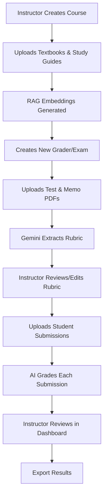
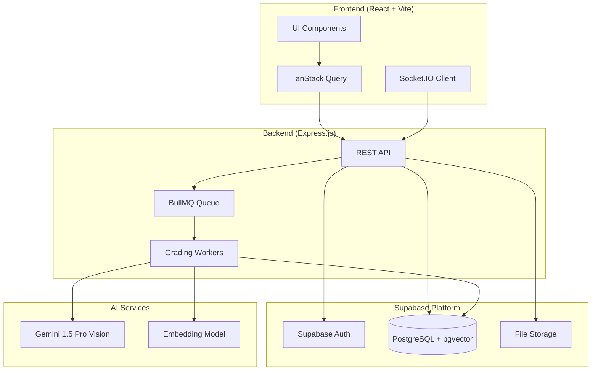
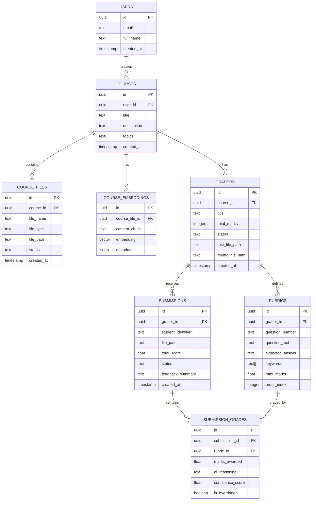
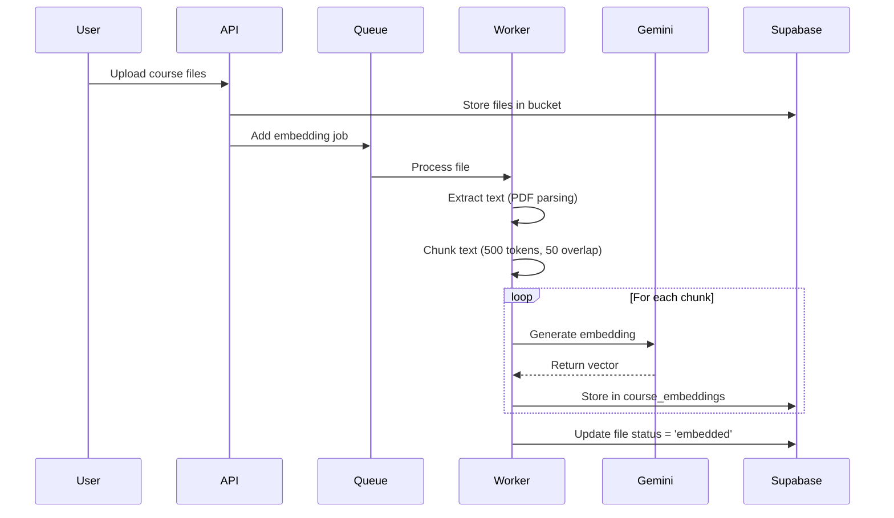
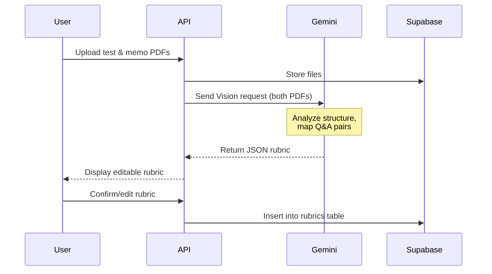
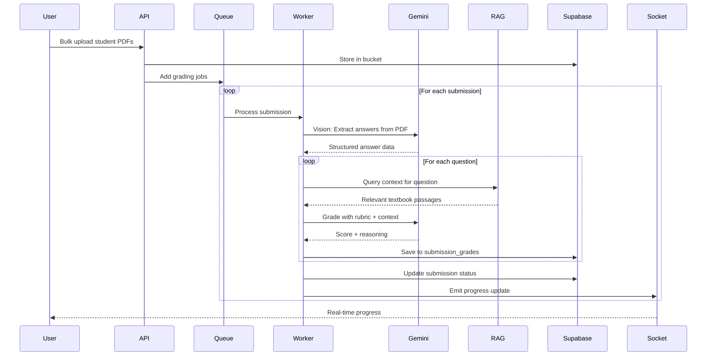

# Cleverly AI Grader - Implementation Plan

An AI-powered grading platform that enables instructors to create courses, upload reference materials, define test rubrics via memos, and automatically grade handwritten student submissions using **Google Gemini 1.5 Pro** and **RAG (Retrieval-Augmented Generation)**.

---

## Table of Contents

1. [Project Overview](#project-overview)
2. [Technology Stack](#technology-stack)
3. [System Architecture](#system-architecture)
4. [Database Schema](#database-schema)
5. [Frontend Architecture](#frontend-architecture)
6. [Backend Architecture](#backend-architecture)
7. [AI Pipeline & Workflow](#ai-pipeline--workflow)
8. [API Specification](#api-specification)
9. [Project Structure](#project-structure)
10. [Development Phases](#development-phases)
11. [Verification Plan](#verification-plan)

---

## Project Overview

### Core Features

| Feature | Description |
|---------|-------------|
| **Course Management** | Create courses, upload textbooks/study guides for RAG context |
| **Rubric Generator** | Upload test papers & memos → AI extracts structured rubrics |
| **Automated Grading** | Gemini Vision analyzes handwritten submissions against rubrics |
| **RAG Enhancement** | Course materials provide contextual grading knowledge |
| **Review Dashboard** | Split-screen view for manual review & score adjustments |
| **Analytics & Export** | Visualize performance data, export to Excel |

### User Flow



---

## Technology Stack

### Frontend

| Category | Technology | Purpose |
|----------|------------|---------|
| Framework | **React.js (Vite)** | Fast build tooling, modern DX |
| Styling | **Tailwind CSS + Shadcn UI** | Consistent, accessible components |
| Server State | **TanStack Query (React Query)** | Caching, mutations, real-time sync |
| Local State | **Zustand** | Lightweight global state management |
| Real-time | **Socket.IO Client** | Live grading progress updates |
| PDF Rendering | **react-pdf** | Display student submissions |
| PDF Export | **jspdf + jspdf-autotable** | Generate grade reports |

### Backend

| Category | Technology | Purpose |
|----------|------------|---------|
| Runtime | **Node.js 20+** | JavaScript runtime |
| Framework | **Express.js** | REST API server |
| AI SDK | **@google/generative-ai** | Gemini 1.5 Pro integration |
| Queue | **BullMQ + Redis** | Async job processing for bulk grading |
| Validation | **Zod** | Schema validation |
| Logging | **Pino** | Structured logging |

### Database & Infrastructure (Supabase)

| Component | Technology | Purpose |
|-----------|------------|---------|
| Database | **PostgreSQL** | Primary data store |
| Auth | **Supabase Auth** | JWT-based authentication |
| Vector Store | **pgvector extension** | RAG embeddings storage |
| File Storage | **Supabase Storage** | PDF and image uploads |
| Edge Functions | **Supabase Functions** | Serverless triggers (optional) |

---

## System Architecture



---

## Database Schema

### Entity Relationship Diagram



### SQL Migrations

#### [NEW] `migrations/001_initial_schema.sql`

```sql
-- Enable required extensions
create extension if not exists "uuid-ossp";
create extension if not exists "vector";

-- Users table (extends Supabase auth.users)
create table public.profiles (
  id uuid references auth.users on delete cascade primary key,
  email text unique,
  full_name text,
  avatar_url text,
  created_at timestamp with time zone default now()
);

-- Row Level Security
alter table public.profiles enable row level security;

create policy "Users can view own profile"
  on public.profiles for select
  using (auth.uid() = id);

create policy "Users can update own profile"
  on public.profiles for update
  using (auth.uid() = id);
```

#### [NEW] `migrations/002_courses.sql`

```sql
-- Courses table
create table public.courses (
  id uuid primary key default uuid_generate_v4(),
  user_id uuid references public.profiles(id) on delete cascade not null,
  title text not null,
  description text,
  topics text[] default '{}',
  created_at timestamp with time zone default now(),
  updated_at timestamp with time zone default now()
);

-- Course files (textbooks, study guides)
create table public.course_files (
  id uuid primary key default uuid_generate_v4(),
  course_id uuid references public.courses(id) on delete cascade not null,
  file_name text not null,
  file_type text not null, -- 'textbook', 'study_guide', 'notes'
  file_path text not null,
  file_size bigint,
  status text default 'pending', -- 'pending', 'processing', 'embedded', 'failed'
  created_at timestamp with time zone default now()
);

-- Vector embeddings for RAG
create table public.course_embeddings (
  id uuid primary key default uuid_generate_v4(),
  course_file_id uuid references public.course_files(id) on delete cascade not null,
  content_chunk text not null,
  embedding vector(768), -- Gemini embedding dimension
  metadata jsonb default '{}',
  created_at timestamp with time zone default now()
);

-- Create vector index for similarity search
create index on public.course_embeddings 
  using ivfflat (embedding vector_cosine_ops)
  with (lists = 100);

-- RLS Policies
alter table public.courses enable row level security;
alter table public.course_files enable row level security;
alter table public.course_embeddings enable row level security;

create policy "Users can CRUD own courses"
  on public.courses for all
  using (auth.uid() = user_id);

create policy "Users can CRUD own course files"
  on public.course_files for all
  using (
    course_id in (
      select id from public.courses where user_id = auth.uid()
    )
  );

create policy "Users can CRUD own embeddings"
  on public.course_embeddings for all
  using (
    course_file_id in (
      select cf.id from public.course_files cf
      join public.courses c on cf.course_id = c.id
      where c.user_id = auth.uid()
    )
  );
```

#### [NEW] `migrations/003_grading_module.sql`

```sql
-- Graders (exam/test containers)
create table public.graders (
  id uuid primary key default uuid_generate_v4(),
  course_id uuid references public.courses(id) on delete cascade not null,
  title text not null,
  total_marks integer,
  status text default 'draft', -- 'draft', 'ready', 'grading', 'completed'
  test_file_path text,
  memo_file_path text,
  created_at timestamp with time zone default now(),
  updated_at timestamp with time zone default now()
);

-- Rubrics (extracted from memo)
create table public.rubrics (
  id uuid primary key default uuid_generate_v4(),
  grader_id uuid references public.graders(id) on delete cascade not null,
  question_number text not null,
  question_text text,
  expected_answer text not null,
  keywords text[] default '{}',
  max_marks float not null,
  order_index integer default 0,
  created_at timestamp with time zone default now()
);

-- Student submissions
create table public.submissions (
  id uuid primary key default uuid_generate_v4(),
  grader_id uuid references public.graders(id) on delete cascade not null,
  student_identifier text,
  file_path text not null,
  total_score float,
  max_possible_score float,
  percentage float,
  status text default 'pending', -- 'pending', 'processing', 'graded', 'flagged', 'reviewed'
  feedback_summary text,
  processed_at timestamp with time zone,
  created_at timestamp with time zone default now()
);

-- Individual question grades
create table public.submission_grades (
  id uuid primary key default uuid_generate_v4(),
  submission_id uuid references public.submissions(id) on delete cascade not null,
  rubric_id uuid references public.rubrics(id) on delete cascade not null,
  marks_awarded float not null,
  ai_reasoning text,
  confidence_score float default 1.0, -- 0.0 to 1.0
  is_overridden boolean default false,
  override_reason text,
  created_at timestamp with time zone default now(),
  updated_at timestamp with time zone default now()
);

-- Indexes for performance
create index idx_graders_course on public.graders(course_id);
create index idx_rubrics_grader on public.rubrics(grader_id);
create index idx_submissions_grader on public.submissions(grader_id);
create index idx_submission_grades_submission on public.submission_grades(submission_id);
create index idx_submissions_status on public.submissions(status);

-- RLS Policies
alter table public.graders enable row level security;
alter table public.rubrics enable row level security;
alter table public.submissions enable row level security;
alter table public.submission_grades enable row level security;

create policy "Users can CRUD own graders"
  on public.graders for all
  using (
    course_id in (
      select id from public.courses where user_id = auth.uid()
    )
  );

create policy "Users can CRUD own rubrics"
  on public.rubrics for all
  using (
    grader_id in (
      select g.id from public.graders g
      join public.courses c on g.course_id = c.id
      where c.user_id = auth.uid()
    )
  );

create policy "Users can CRUD own submissions"
  on public.submissions for all
  using (
    grader_id in (
      select g.id from public.graders g
      join public.courses c on g.course_id = c.id
      where c.user_id = auth.uid()
    )
  );

create policy "Users can CRUD own submission grades"
  on public.submission_grades for all
  using (
    submission_id in (
      select s.id from public.submissions s
      join public.graders g on s.grader_id = g.id
      join public.courses c on g.course_id = c.id
      where c.user_id = auth.uid()
    )
  );
```

---

## Frontend Architecture

### Application Routes

| Route | Component | Description |
|-------|-----------|-------------|
| `/` | `LandingPage` | Marketing/login page |
| `/dashboard` | `Dashboard` | Course overview & stats |
| `/courses/:id` | `CourseDetail` | Course files & graders list |
| `/courses/:id/grader/new` | `GraderSetup` | Create new exam/test |
| `/graders/:id` | `GradingDashboard` | Main grading interface |
| `/graders/:id/analytics` | `AnalyticsView` | Results & charts |

### Component Hierarchy

```
src/
├── components/
│   ├── ui/                     # Shadcn UI components
│   ├── layout/
│   │   ├── Navbar.tsx
│   │   ├── Sidebar.tsx
│   │   └── PageContainer.tsx
│   ├── course/
│   │   ├── CourseCard.tsx
│   │   ├── CourseModal.tsx
│   │   └── FileUploader.tsx
│   ├── grader/
│   │   ├── RubricEditor.tsx
│   │   ├── RubricTable.tsx
│   │   └── MemoUploader.tsx
│   ├── grading/
│   │   ├── GradingPanel.tsx
│   │   ├── PDFViewer.tsx
│   │   ├── SubmissionList.tsx
│   │   ├── QuestionAccordion.tsx
│   │   └── ScoreInput.tsx
│   └── analytics/
│       ├── ScoreDistribution.tsx
│       ├── QuestionAnalysis.tsx
│       └── ExportButton.tsx
├── pages/
│   ├── Landing.tsx
│   ├── Dashboard.tsx
│   ├── CourseDetail.tsx
│   ├── GraderSetup.tsx
│   ├── GradingDashboard.tsx
│   └── Analytics.tsx
├── hooks/
│   ├── useCourses.ts
│   ├── useGraders.ts
│   ├── useSubmissions.ts
│   └── useGradingSocket.ts
├── stores/
│   ├── authStore.ts
│   └── gradingStore.ts
├── lib/
│   ├── supabase.ts
│   ├── api.ts
│   └── utils.ts
└── types/
    └── index.ts
```

### Key UI Components

#### 1. Grader Setup Page (RubricEditor)

```
┌─────────────────────────────────────────────────────────────────┐
│  Create New Grader                                        [X]   │
├─────────────────────────────────────────────────────────────────┤
│                                                                 │
│  Title: [Calculus Midterm 1                              ]      │
│                                                                 │
│  ┌──────────────────────┐  ┌──────────────────────┐             │
│  │ 📄 Test Paper        │  │ 📄 Memorandum        │             │
│  │  [Drop PDF Here]     │  │  [Drop PDF Here]     │             │
│  │                      │  │                      │             │
│  │  midterm_q.pdf ✓     │  │  midterm_memo.pdf ✓  │             │
│  └──────────────────────┘  └──────────────────────┘             │
│                                                                 │
│  [Extract Rubric with AI ✨]                                    │
│                                                                 │
│  ━━━━━━━━━━━━━━━━━━━━━━━━━━━━━━━━━━━━━━━━━━━━━━━━━━━━━━━━━━━━━  │
│                                                                 │
│  Extracted Rubric (Editable)                                    │
│  ┌─────┬─────────────────┬─────────────────┬────────┐           │
│  │ Q#  │ Question        │ Expected Answer │ Marks  │           │
│  ├─────┼─────────────────┼─────────────────┼────────┤           │
│  │ 1.a │ Find dy/dx...   │ 2x + 3          │ [5]    │           │
│  │ 1.b │ Evaluate...     │ 42              │ [3]    │           │
│  │ 2   │ Prove that...   │ Using L'Hop...  │ [10]   │           │
│  └─────┴─────────────────┴─────────────────┴────────┘           │
│  [+ Add Question]                                               │
│                                                                 │
│                        [Cancel]  [Save & Continue →]            │
└─────────────────────────────────────────────────────────────────┘
```

#### 2. Grading Dashboard (Split-Screen)

```
┌───────────────────────────────────────────────────────────────────────────┐
│  Calculus Midterm 1 - Grading                    [Analytics] [Export]    │
├───────────────────────────────────────────────────────────────────────────┤
│                                                                           │
│  Students: ████████████░░░░ 75% (15/20 graded)   [← Prev] [Next →]       │
│                                                                           │
├─────────────────────────────────┬─────────────────────────────────────────┤
│                                 │                                         │
│  📄 Student: John Smith         │  ▼ Question 1.a (5 marks)              │
│     ID: STU001                  │    ┌──────────────────────────────┐    │
│                                 │    │ Expected: 2x + 3             │    │
│  ┌─────────────────────────┐    │    │ Keywords: derivative, chain  │    │
│  │                         │    │    └──────────────────────────────┘    │
│  │     [PDF Viewer]        │    │                                         │
│  │                         │    │    AI Feedback:                         │
│  │   Page 1 of 5           │    │    ✓ Correct derivative computed       │
│  │                         │    │    ✗ Missing chain rule step           │
│  │   🔍 Zoom: [+] [-]      │    │                                         │
│  │                         │    │    Confidence: ████████░░ 85%          │
│  │                         │    │                                         │
│  │                         │    │    Score: [4] / 5  [Override ✏️]       │
│  │                         │    │                                         │
│  └─────────────────────────┘    │  ────────────────────────────────────── │
│                                 │                                         │
│  [◀ Page] [Page ▶]              │  ▶ Question 1.b (3 marks) → 3/3 ✓      │
│                                 │  ▶ Question 2 (10 marks) → 8/10 ⚠️     │
│                                 │                                         │
├─────────────────────────────────┴─────────────────────────────────────────┤
│  Total: 78/100 (78%)                              [Save] [Flag for Review]│
└───────────────────────────────────────────────────────────────────────────┘
```

---

## Backend Architecture

### Server Structure

```
server/
├── src/
│   ├── index.ts                 # Express app entry
│   ├── config/
│   │   ├── env.ts               # Environment variables
│   │   └── supabase.ts          # Supabase client
│   ├── middleware/
│   │   ├── auth.ts              # JWT verification
│   │   ├── errorHandler.ts      # Global error handling
│   │   └── validateRequest.ts   # Zod validation
│   ├── routes/
│   │   ├── courses.ts
│   │   ├── graders.ts
│   │   ├── submissions.ts
│   │   └── analytics.ts
│   ├── services/
│   │   ├── embeddingService.ts  # Text chunking & embeddings
│   │   ├── rubricService.ts     # Memo parsing with Gemini
│   │   ├── gradingService.ts    # Core grading logic
│   │   └── ragService.ts        # Vector search & context
│   ├── workers/
│   │   ├── embeddingWorker.ts   # Process file embeddings
│   │   └── gradingWorker.ts     # Process grading jobs
│   ├── prompts/
│   │   ├── rubricExtraction.ts
│   │   ├── grading.ts
│   │   └── feedback.ts
│   └── types/
│       └── index.ts
├── package.json
└── tsconfig.json
```

### AI Prompt Templates

#### Rubric Extraction Prompt

```typescript
// prompts/rubricExtraction.ts
export const RUBRIC_EXTRACTION_PROMPT = `
You are an expert educational assessment analyst. You have been given two documents:
1. A TEST PAPER containing questions
2. A MEMORANDUM containing model answers and marking guidelines

Your task is to analyze both documents and extract a structured rubric.

OUTPUT FORMAT (JSON Array):
[
  {
    "question_number": "1.a",
    "question_text": "The actual question text",
    "expected_answer": "The model answer from the memo",
    "keywords": ["key", "terms", "for", "marks"],
    "max_marks": 5
  }
]

RULES:
- Extract EVERY question, including sub-questions (1.a, 1.b, etc.)
- Include mark allocations exactly as specified in the memo
- Identify keywords that are essential for earning marks
- Preserve mathematical notation using LaTeX format where applicable

Analyze the documents and provide the JSON output:
`;
```

#### Grading Prompt

```typescript
// prompts/grading.ts
export const GRADING_PROMPT = `
You are a strict but fair university professor grading a student's exam.

RUBRIC:
Question: {question_text}
Expected Answer: {expected_answer}
Keywords Required: {keywords}
Maximum Marks: {max_marks}

COURSE CONTEXT (from textbook/study materials):
{rag_context}

STUDENT'S ANSWER (from handwritten submission):
{student_answer}

GRADING INSTRUCTIONS:
1. Compare the student's answer to the expected answer
2. Check if required keywords/concepts are present
3. Use the course context to verify alternative phrasings
4. Partial marks are allowed based on the marking rubric
5. Be lenient with spelling errors if the concept is correct
6. Award method marks even if the final answer is wrong

OUTPUT FORMAT (JSON):
{
  "marks_awarded": <number>,
  "reasoning": "Step-by-step explanation of how marks were awarded",
  "confidence_score": <0.0 to 1.0>,
  "feedback": "Constructive feedback for the student"
}
`;
```

---

## AI Pipeline & Workflow

### Phase 1: RAG Setup Pipeline



### Phase 2: Rubric Extraction Pipeline



### Phase 3: Automated Grading Pipeline



---

## API Specification

### Authentication

All endpoints require `Authorization: Bearer <jwt_token>` header.

### Endpoints

#### Courses

| Method | Endpoint | Description |
|--------|----------|-------------|
| `GET` | `/api/courses` | List user's courses |
| `POST` | `/api/courses` | Create new course |
| `GET` | `/api/courses/:id` | Get course details |
| `PUT` | `/api/courses/:id` | Update course |
| `DELETE` | `/api/courses/:id` | Delete course |
| `POST` | `/api/courses/:id/files` | Upload course file |
| `GET` | `/api/courses/:id/files` | List course files |

#### Graders

| Method | Endpoint | Description |
|--------|----------|-------------|
| `POST` | `/api/graders` | Create grader (upload test/memo) |
| `GET` | `/api/graders/:id` | Get grader with rubric |
| `POST` | `/api/graders/:id/extract-rubric` | Trigger AI extraction |
| `PUT` | `/api/graders/:id/rubric` | Save edited rubric |
| `PATCH` | `/api/graders/:id/status` | Update grader status |

#### Submissions

| Method | Endpoint | Description |
|--------|----------|-------------|
| `POST` | `/api/graders/:id/submissions` | Bulk upload submissions |
| `GET` | `/api/graders/:id/submissions` | List all submissions |
| `GET` | `/api/submissions/:id` | Get submission details + grades |
| `POST` | `/api/graders/:id/grade-all` | Start batch grading |
| `PATCH` | `/api/submission-grades/:id` | Override AI grade |

#### Analytics

| Method | Endpoint | Description |
|--------|----------|-------------|
| `GET` | `/api/graders/:id/analytics` | Get grader statistics |
| `GET` | `/api/graders/:id/export` | Export results as Excel |

### Request/Response Examples

#### Create Grader

```http
POST /api/graders
Content-Type: multipart/form-data

{
  "course_id": "uuid",
  "title": "Calculus Midterm 1",
  "test_file": <File>,
  "memo_file": <File>
}
```

Response:
```json
{
  "id": "uuid",
  "status": "processing",
  "message": "Extracting rubric with AI..."
}
```

#### Get Submission Grades

```http
GET /api/submissions/:id
```

Response:
```json
{
  "id": "uuid",
  "student_identifier": "STU001",
  "file_url": "https://...",
  "total_score": 78,
  "max_possible_score": 100,
  "percentage": 78,
  "status": "graded",
  "feedback_summary": "Strong understanding of derivatives...",
  "grades": [
    {
      "id": "uuid",
      "rubric_id": "uuid",
      "question_number": "1.a",
      "marks_awarded": 4,
      "max_marks": 5,
      "ai_reasoning": "Correct approach but missing...",
      "confidence_score": 0.85,
      "is_overridden": false
    }
  ]
}
```

---

## Project Structure

```
cleverly_ai_grader_mvp/
├── client/                      # React Frontend
│   ├── public/
│   ├── src/
│   │   ├── components/
│   │   ├── pages/
│   │   ├── hooks/
│   │   ├── stores/
│   │   ├── lib/
│   │   ├── types/
│   │   ├── App.tsx
│   │   ├── main.tsx
│   │   └── index.css
│   ├── index.html
│   ├── package.json
│   ├── tailwind.config.js
│   ├── vite.config.ts
│   └── tsconfig.json
│
├── server/                      # Express Backend
│   ├── src/
│   │   ├── config/
│   │   ├── middleware/
│   │   ├── routes/
│   │   ├── services/
│   │   ├── workers/
│   │   ├── prompts/
│   │   ├── types/
│   │   └── index.ts
│   ├── package.json
│   └── tsconfig.json
│
├── supabase/                    # Database Migrations
│   └── migrations/
│       ├── 001_initial_schema.sql
│       ├── 002_courses.sql
│       └── 003_grading_module.sql
│
├── .env.example                 # Environment template
├── docker-compose.yml           # Local dev services (Redis)
├── README.md
└── package.json                 # Workspace root
```

---

## Development Phases

### Phase 1: Foundation (Week 1-2)

| Task | Priority | Estimated Time |
|------|----------|----------------|
| Project scaffolding (Vite + Express) | High | 4 hours |
| Supabase setup & migrations | High | 4 hours |
| Authentication flow (Supabase Auth) | High | 6 hours |
| Course CRUD + file upload | High | 8 hours |
| RAG embedding pipeline | High | 12 hours |

**Deliverable:** Users can create courses and upload materials that get embedded.

---

### Phase 2: Rubric Generator (Week 2-3)

| Task | Priority | Estimated Time |
|------|----------|----------------|
| Grader creation UI | High | 6 hours |
| PDF upload to Supabase Storage | High | 4 hours |
| Gemini rubric extraction | High | 10 hours |
| Rubric editor component | High | 8 hours |
| Save/update rubric API | Medium | 4 hours |

**Deliverable:** Instructors can upload test/memo and get AI-extracted rubrics.

---

### Phase 3: Grading Engine (Week 3-4)

| Task | Priority | Estimated Time |
|------|----------|----------------|
| BullMQ queue setup | High | 4 hours |
| Gemini Vision answer extraction | High | 10 hours |
| RAG context retrieval | High | 6 hours |
| Grading prompt engineering | High | 8 hours |
| Submission result storage | High | 6 hours |
| Socket.IO progress updates | Medium | 4 hours |

**Deliverable:** Students submissions are automatically graded with AI.

---

### Phase 4: Review Dashboard (Week 4-5)

| Task | Priority | Estimated Time |
|------|----------|----------------|
| Split-screen layout | High | 6 hours |
| PDF viewer integration | High | 6 hours |
| Question accordion component | High | 4 hours |
| Score override functionality | High | 4 hours |
| Flagging system | Medium | 3 hours |
| Bulk actions (approve all, etc.) | Low | 4 hours |

**Deliverable:** Instructors can review and adjust AI grades.

---

### Phase 5: Analytics & Polish (Week 5-6)

| Task | Priority | Estimated Time |
|------|----------|----------------|
| Analytics dashboard | Medium | 8 hours |
| Charts (score distribution, etc.) | Medium | 6 hours |
| Excel export | Medium | 4 hours |
| Error handling & edge cases | High | 6 hours |
| Performance optimization | Medium | 4 hours |
| UI polish & responsive design | Medium | 6 hours |

**Deliverable:** Full MVP ready for testing.

---

## Verification Plan

### Automated Tests

#### Unit Tests
```bash
# Backend services
npm run test:server

# Frontend components
npm run test:client
```

#### Integration Tests
```bash
# API endpoint testing
npm run test:api

# Database operations
npm run test:db
```

### Manual Verification Checklist

- [ ] **Authentication Flow**
  - [ ] User can sign up and login
  - [ ] Protected routes redirect unauthenticated users
  - [ ] JWT tokens are properly handled

- [ ] **Course Management**
  - [ ] Create, read, update, delete courses
  - [ ] File upload to Supabase bucket works
  - [ ] Embedding generation completes successfully
  - [ ] Vector similarity search returns relevant chunks

- [ ] **Rubric Extraction**
  - [ ] Gemini processes PDF files correctly
  - [ ] Extracted rubric matches memo content
  - [ ] Rubric editor allows modifications
  - [ ] Saved rubric persists in database

- [ ] **Automated Grading**
  - [ ] Bulk upload processes multiple PDFs
  - [ ] Gemini Vision extracts handwriting
  - [ ] RAG context enhances grading accuracy
  - [ ] Grades are within expected range
  - [ ] Low confidence answers are flagged

- [ ] **Review Dashboard**
  - [ ] PDF viewer displays submissions correctly
  - [ ] Question accordion shows AI reasoning
  - [ ] Score override saves to database
  - [ ] Navigation between submissions works

- [ ] **Analytics**
  - [ ] Statistics calculate correctly
  - [ ] Charts render properly
  - [ ] Excel export contains all data

---

## User Review Required

> [!IMPORTANT]
> **API Key Management**: The system requires a Google Gemini API key. Should this be configured per-user or as a system-wide key?

> [!WARNING]
> **Cost Considerations**: Gemini Vision API calls can be expensive at scale. Consider implementing:
> - Request batching
> - Caching for repeated queries
> - Usage limits per user/course

> [!CAUTION]
> **Data Privacy**: Student submission data may contain PII. Ensure:
> - Supabase RLS policies are correctly configured
> - Data retention policies are defined
> - GDPR/FERPA compliance if applicable

---

## Next Steps

1. **Approve this plan** to proceed with development
2. **Configure Supabase project** and obtain credentials
3. **Obtain Google Gemini API key** for AI features
4. **Set up local development environment**

Ready to begin Phase 1 upon approval.
